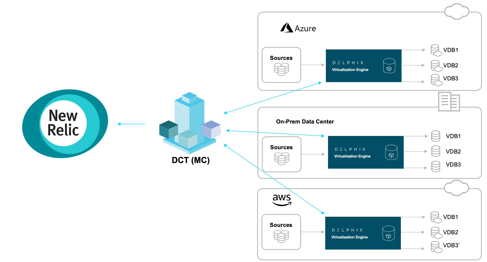
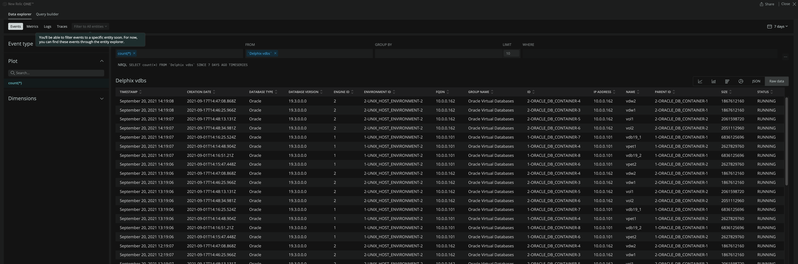
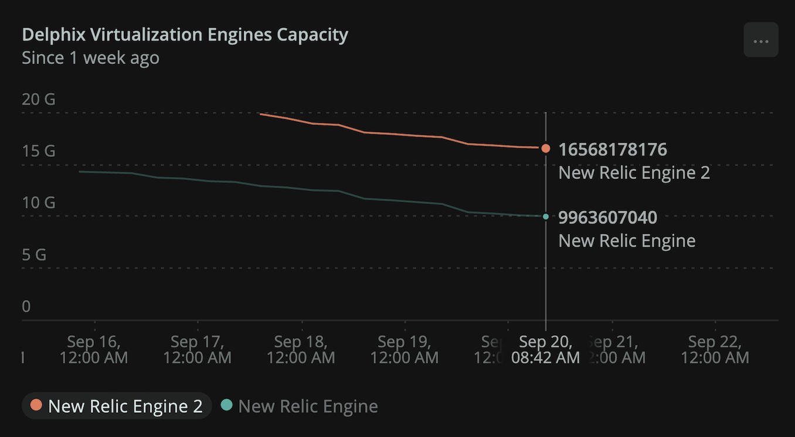

# Delphix Data Control Tower's Integration with New Relic

This project will allow you to send data from [Delphix Data Control Tower (DCT)](https://delphix.document360.io/dct/docs) to [New Relic](https://newrelic.com/) through the Events API. This repository is one component of the Delphix Quickstart. You can learn more on the [Delphix Instant Observability page](https://newrelic.com/instant-observability/delphix).




## Getting Started

These instructions will provide the information you need to extract data from DCT and send it to New Relic. The Python script can run from any location with access to both DCT and New Relic.


### Prerequisites

* New Relic Account: [Sign Up](https://newrelic.com/signup)
* Delphix Data Control Tower (DCT) with one or more engines: [Data Control Tower Docs](https://delphix.document360.io/dct/docs)
* Python 3.8+: [Python Install](https://www.python.org/downloads)
* This [GitHub repository](https://github.com/delphix/dct-newrelic-integration)

Note: If you are using Windows, `py` may be specified instead of `python`.


### Setup
The ```src/main.py``` script contains the logic to perform the data upload. However, you must do some configuration first. 

#### Package Installation
Run the following 2 pip installation commands to install the required Python packages:
```python -m pip install requests```
```python -m pip install newrelic_telemetry_sdk```

#### Required Variable Configuration
Retrieve the following:
* Record the DCT URL.
* Generate a [DCT API Key](https://delphix.document360.io/docs/authentication
* Generate a [New Relic INGEST - LICENSE Key](https://docs.newrelic.com/docs/apis/intro-apis/new-relic-api-keys/#ingest-license-key).

Once we have these values, specify the following environment variables:
* DCT_URL
* DCT_KEY
* NEW_RELIC_KEY

Note: You may modify the Python script directly, but it is best practice to specify sensitive data through environment variables.

#### Optional Variable Configuration
Some variables, such as Components, Interval, and Logging variables, are set by default in the `dct_nr_config.ini` file. These can be  updated to modify which APIs to call, how long to wait between syncs, or logging level.

### Execution

You may test the script by running the following command:
```python src/main.py```

In production, it is common to use a scheduler, such as a systemd, nohup, or wininit.exe, to ensure the script continually runs. For example, the following nohup command will run the script every N seconds based on the Interval provided in the `dct_nr_config.ini` file:
```nohup python src/main.py &```

On each execution, this script will extract the following metrics from all registered Delphix engines:

* Engines - Data extraction date, CPU Count, Storage, Memory, Engine Type, Version, etc.
* Environments - Data extraction date, Status, Engine ID, Name, etc.
* Sources - Data extraction date, Database Type, Database Version, Environment ID, JDBC Connection String, Database Name and Size, etc
* dSources - Data extraction date, dSource Creation Date, dSource Type, Version, Name, Status, Size, etc.
* VDBs - Data extraction date, Database Type and Version, Creation Date, Group Name, Name, Parent ID, Size, Status, etc.


## Data, Dashboards, and Alerts

Once the data is available within New Relic, you are free to leverage it as you wish through customized Dashboards and Alerts. Samples can be found as a part of the [Delphix Quickstart](https://newrelic.com/instant-observability/delphix). 

As an example, this is how the raw data looks like in the [Query your data](https://docs.newrelic.com/docs/query-your-data/explore-query-data/get-started/introduction-querying-new-relic-data/#browse-data) window for the VDB metric:



With this data we can create graphs and dashboards like this:



And this is the query we used to create this graph:

```
SELECT MAX(data_storage_capacity)-MIN(data_storage_used) FROM `Delphix engines` SINCE 7 DAYS AGO TIMESERIES facet name
```


## Contributing

Please read [CONTRIBUTING.md](https://github.com/delphix/.github/blob/master/CONTRIBUTING.md) for details on our code of conduct, and the process for submitting pull requests to us.


## Versioning

We use [SemVer](http://semver.org/) for versioning. For the versions available, see the [tags on this repository](https://github.com/your/project/tags).


## Reporting Issues and Questions

Please report all issues and questions in the [GitHub issue tab](https://github.com/delphix/dct-newrelic-integration/issues) or [Delphix Community page](https://community.delphix.com/home). Please include a complete problem description, error logs if appropriate, and directions on how to reproduce.


## Statement of Support

This software is provided as-is, without warranty of any kind or commercial support through Delphix. See the associated license for additional details. Questions, issues, feature requests, and contributions should be directed to the community as outlined in the Delphix Community Guidelines.

License
```
 Licensed under the Apache License, Version 2.0 (the "License");
 you may not use this file except in compliance with the License.
 You may obtain a copy of the License at

     http://www.apache.org/licenses/LICENSE-2.0

 Unless required by applicable law or agreed to in writing, software
 distributed under the License is distributed on an "AS IS" BASIS,
 WITHOUT WARRANTIES OR CONDITIONS OF ANY KIND, either express or implied.
 See the License for the specific language governing permissions and
 limitations under the License.
 ```
Copyright (c) 2021, 2022 by Delphix. All rights reserved.
